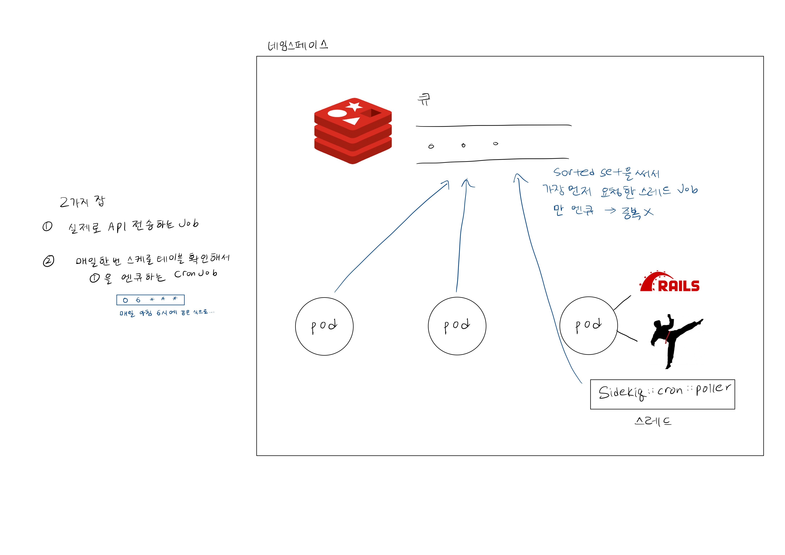
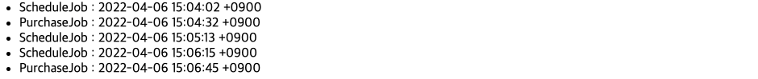

Scheduling Demo
===============


start local server
------------------

1) `bundle install`

2) create `.env` file
```
DB_USERNAME={username}
DB_PASSWORD={password}
```

3) database setting
```
mysql.server start

rails db:create
rails db:migrate
rails db:seed
```

4) start server
```
rails s

redis-server
bundle exec sidekiq
```

5) visit `http://localhost:3000/schedule`


cluster test
------------
로컬 클러스터에 실제로 스케줄링 앱을 배포 해서, pod가 여러개 띄워져 있을 때 CronJob 이 중복 되지는 않는지, pod를 죽였을 때 어떻게 동작하는지와 같은 것들을 테스트 해봅시다.

### 환경 구성
1) create new local cluster
```
minikube start
```

2) build and push docker image
```
docker build -t jjmmyyou111/schedule-app .
docker push jjmmyyou111/schedule-app:latest
``` 

3) deploy resources
```
kubectl apply -f ./cluster/redis.yaml
kubectl apply -f ./cluster/mysql.yaml
kubectl apply -f ./cluster/app.yaml
```

4) db setting
```
kubectl get pods
kubectl exec -it po/<schedule-app pod> -c schedule-app -- sh

rails db:create
rails db:migrate
rails db:seed
```
5) 포트 포워딩으로 app에 접속하기  
  
[kubernetes port-forward doc](https://kubernetes.io/ko/docs/tasks/access-application-cluster/port-forward-access-application-cluster/)  

```
kubectl port-forward service/schedule-service 3000:3000
```
6) visit `localhost:3000` !

<br>

디버깅

```
kubectl logs -f <pod> -c schedule-app

apk add --update curl
curl -X GET -H "Content-Type: application/json" localhost:3000/schedule/2022-04-05
```

-------------------------
(참고) app에 접속하는 다른 방법  
-> 안됨.. 🤬

```
minikube dashboard
minikube tunnel
```
  
[minikube - Accessing apps](https://minikube.sigs.k8s.io/docs/handbook/accessing/)  
- NodePort  
  opens a specific port, and any traffic that is sent to this port is forwarded to the service.
  ```
  minikube service --url <service-name>
  ```
- LoadBalancer  
  standard way to expose a service to the internet. With this method, each service gets its own IP address.  
  `minikube tunnel` runs as a process, creating a **network route on the host to the service CIDR** of the cluster using the cluster’s IP address as a gateway.
  ```
  minikube tunnel
  ```


ingress  
[minikube-ingerss](https://kubernetes.io/ko/docs/tasks/access-application-cluster/ingress-minikube/)  


### 테스트하기
1) 3개의 pod가 띄워진 상태에서 1분 마다 30초 뒤에 PurchaseJob을 실행하도록 하는 ScheduleJob 이라는 CronJob이 실행되고 있는 상태일 때 `localhost:3000/log` 를 방문해서 해당 CronJob이 pod 개수 만큼 중복 실행되고 있지는 않은지 확인한다.


> Sidekiq-Cron is safe to use with multiple sidekiq processes or nodes. It uses a **Redis sorted set** to determine that only the first process who asks can enqueue scheduled jobs into the queue.

2) schedule-app deployment에 환경 변수 추가해서 전체 pod를 terminating 하고 recreate 했을 때. 어떻게 동작하는지

15:05 경에 PurchaseJob이 실행안되긴 했는데, 다른 조작 없이 pod Running 시 CronJob이 알아서 재가동 했다. 실제 사입 스케줄링 CronJob은 하루 주기일 테니까 상관 없을 것 같다.