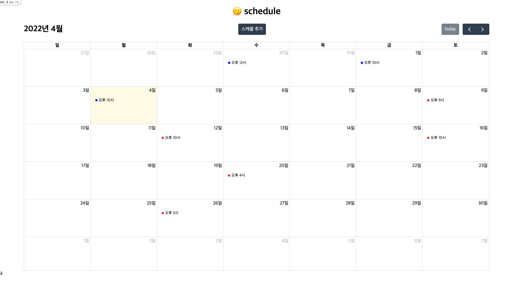

Scheduling Demo
===============

start local server
------------------

1) `bundle install`

2) create `.env` file
```
DB_USERNAME={username}
DB_PASSWORD={password}
```

3) database setting
```
mysql.server start

rails db:create
rails db:migrate
rails db:seed
```

4) `rails s`

5) visit `http://localhost:3000/schedule`


cluster test
------------
1) create new local cluster
```
minikube start --driver=virtualbox
```

2) build and push docker image
```
docker build -t jjmmyyou111/schedule-app .
docker push jjmmyyou111/schedule-app:latest
``` 

3) deploy resources
```
kubectl apply -f ./cluster/redis.yaml
kubectl apply -f ./cluster/mysql.yaml
kubectl apply -f ./cluster/schedule-app.yaml

kubectl get service -o wide
minikube service schedule-app-service
```

로그 보기
```
kubectl logs -f {pod} -c schedule-app
```
